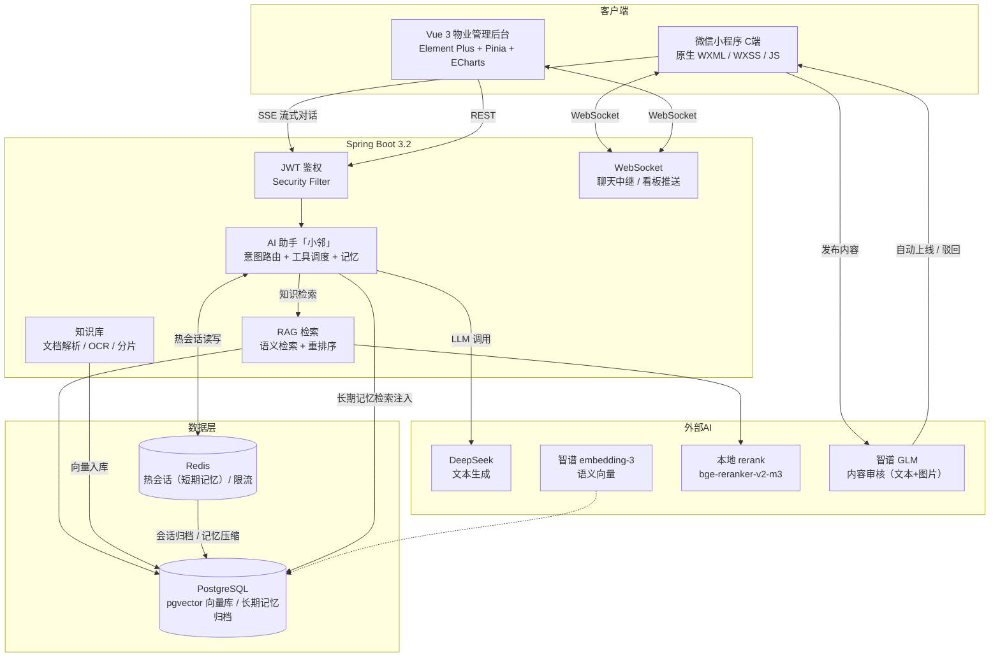

# 一城暖邻 · 社区互助平台

> 邻里互助闲置物品平台 — 微信小程序 C端 + Vue 3 PC 物业管理后台 + Spring Boot 后端（含 AI 助手「小邻」）

## 演示视频

| 视频 | 内容说明 | 链接 |
|---|---|---|
| 🤖 智能助手「小邻」 | RAG 知识问答 / 多轮记忆 / 逐字流式打字机 | [Bilibili](https://www.bilibili.com/video/BV1afu66tEtC/) |
| 📱 微信小程序（C端） | 首页浏览 / 闲置发布 / 借用聊天 / 个人认证 | [Bilibili](https://www.bilibili.com/video/BV13fu66tErA/?) |
| 🖥️ 物业管理后台（B端） | 内容审核 / 知识库文档管理 / 数据统计看板 | [Bilibili](https://www.bilibili.com/video/BV1Qfu66tEBQ/) |

## 系统架构



## 界面截图

| | | |
|---|---|---|
| **微信小程序 C端**（首页） | **物业管理后台 B端**（运营看板） | **AI 助手「小邻」**（知识问答） |
|  |  |  |

## 技术栈

| 层 | 技术 |
|---|---|
| C端 | 微信小程序原生 (WXML + WXSS + JS)（含 WechatSI 语音转文字插件） |
| B端 | Vue 3 + Vite + Element Plus + ECharts + Pinia (TypeScript) |
| 后端 | Spring Boot 3.2 + JPA + PostgreSQL + pgvector |
| 实时 | WebSocket 聊天中继（纯转发不落库，握手 JWT 鉴权） |
| 认证 | JWT（C端 手机号+密码 / B端 账号密码；后端另提供微信 code 登录接口） |
| AI | 智谱 GLM-4-Flash（文本审核/文案生成）+ GLM-4V-Flash（图片审核）+ embedding-3（语义向量）；本地 rerank-service（bge-reranker-v2-m3，FastAPI/Docker，仅回环 127.0.0.1:8001）；知识库条目为 AI 助手「小邻」提供 RAG 检索源 |

## 项目结构

```
community-platform/
├── server/                    # Spring Boot 后端
│   ├── pom.xml
│   └── src/
│       ├── main/java/com/platform/
│       │   ├── config/        # CORS, Security, WebSocket, DataInitializer, SchemaMigration, AiConfig
│       │   ├── security/      # JwtTokenProvider, JwtAuthenticationFilter, JwtHandshakeInterceptor, LoginUser（登录主体，controller 经 SecurityContext 取用户 id/角色）
│       │   ├── ai/            # AI 模块（嵌入、审核、匹配、RAG 检索、文档导入、文案生成、Agent 对话）
│       │   │   ├── embedding/ # EmbeddingClient, EmbeddingService
│       │   │   ├── moderation/# ModerationClient/Service/Scheduler + RetryScheduler/RejectionStore/Task（内容审核；线程池满时拒绝的任务暂存 Redis，由定时任务分钟级重投，超限交每日巡检兜底）
│       │   │   ├── matching/  # MatchingService/Scheduler（供需匹配）
│       │   │   ├── search/    # SemanticSearchService, KnowledgeRetrievalService, KnowledgeHit, RerankerService（RAG 检索 + 语义重排）
│       │   │   ├── document/  # 文档导入：DocumentParserRegistry + pdf/docx/md/csv/xlsx/txt 解析器 + ocr/VisionOcrClient + 分片/清洗/标题派生 + DocumentProcessGuard（幂等防重）
│       │   │   ├── common/    # AiApiInvoker（LLM 调用熔断/缓存）, PromptRepository（提示词目录读取）
│       │   │   └── agent/     # AgentController/Service/SessionService/AgentSessionGuard/AgentTurnGuard/ArchiveService/ArchiveScheduler/ArchiveTiming/RateLimitService/PromptBuilder/ToolDispatcher/IntentRouter/IntentTagStreamFilter/MessagePreFilter/MemoryCompressionService/MemoryRetrievalService（小邻对话，Redis 会话记忆 + 滑动窗口归档 + 长期记忆压缩与记忆注入 + 恢复 + SSE 流式 + 读工具调用 + 写操作动作卡片 + 意图标记跨分片过滤 + 限流 + 消息前置拦截 + 同用户对话请求互斥）
│       │   ├── model/entity/  # 20 JPA 实体（Tenant, Building, Unit, Room, User,
│       │   │                  #   IdleItem, HelpRequest, HelpApplication,
│       │   │                  #   BorrowRequest, Message, Notification,
│       │   │                  #   OperationLog, Rating, ExportLog, KnowledgeItem,
│       │   │                  #   AgentConversation, AgentMessage, AgentMemorySegment,
│       │   │                  #   KnowledgeDocument, SensitiveWord）
│       │   ├── model/entity/column/  # 20 表字段常量类（实体列名集中管理）
│       │   ├── model/dto/     # 60 DTO（请求参数、响应视图模型、SSE/WebSocket 消息）
│       │   ├── repository/    # 20 Repository
│       │   ├── service/       # 15 Service（含 WeChatService、KnowledgeDocumentService、KnowledgeImportService、SensitiveWordService）
│       │   ├── controller/    # 12 Controller
│       │   ├── websocket/     # ChatWebSocketHandler, DashboardWebSocketHandler
│       │   └── common/        # Result + Exception + 23 常量类（AgentEventType, BizStatus, PostType, DamageType, KnowledgeCategory 等）
│       ├── main/resources/
│       │   ├── application.yml
│       │   ├── prompts/       # 提示词目录（agent/system.md + agent/tools.md + agent/replies.md + agent/injection.md、block/replies.md、memory/*.md，由 PromptRepository 读取）
│       │   └── db/            # schema.sql（14 张表）+ seed-*.sql + alter-*.sql（知识库/Agent 归档/敏感词/记忆压缩段 增量表）
│       └── test/java/com/platform/   # 53 个单元测试类（ai/agent、ai/document、ai/moderation、ai/common、ai/search、service、security 等）
│
├── miniprogram/               # C端微信小程序
│   ├── app.js / app.json / app.wxss
│   ├── utils/                 # api.js, auth.js, ws.js
│   ├── components/            # nav-bar, star-rating, empty-state, image-uploader, chat-input-bar, record-overlay
│   └── pages/                 # 18 个页面
│       ├── boot/              # 启动页（首个页面）：冷启动会话恢复与路由分发，消除登录页闪现
│       ├── login/ register/ review-status/
│       ├── home/ search/
│       ├── idle-detail/ help-detail/
│       ├── publish-idle/      # 双模式表单：闲置发布 + 求助发布
│       ├── chat/ messages/ assistant/   # assistant 为小邻对话页（无底栏单页）；assistant/assistant-entry 为 tab 中转页
│       ├── return-detail/ rating/
│       ├── service-notice/
│       └── my-posts/ profile/
│
├── admin/                     # B端 Vue 3 后台
│   └── src/
│       # `@/` 路径别名 → src/（vite.config.js resolve + tsconfig paths）
│       ├── views/             # 10 个视图（Dashboard, Audit, Content, Records,
│       │                      #   Knowledge, SensitiveWord, Export, Settings, Home, Login）
│       ├── layouts/           # AppLayout 统一布局骨架（侧边栏+顶栏+内容区）, main-classes.ts
│       ├── components/        # AppSidebar, StatCard
│       ├── stores/            # Pinia：auth, community
│       ├── router/            # Vue Router + auth guard
│       ├── utils/             # api.js (axios), ws.js
│       └── styles/            # b-end.css
│
├── rerank-service/            # 语义重排服务（FastAPI + bge-reranker-v2-m3，Docker，仅回环 127.0.0.1:8001）
├── .claude/                   # Claude 协作机制（agents/skills）+ 审查报告归档（review-reports/）
├── CLAUDE.md                  # 项目约定与协作机制
└── README.md
```

## 本地启动

### 1. PostgreSQL

```bash
# 创建数据库
createdb community_platform

# 或使用 psql
psql -U postgres -c "CREATE DATABASE community_platform;"
```

### 2. 后端 (Spring Boot)

```bash
# 设置数据库密码（密钥不提交仓库，本地启动前导出）
export DB_PASSWORD="你的数据库密码"
# 设置 JWT 密钥（生产至少 256 位随机串）
export JWT_SECRET="你的-jwt-密钥"

cd server
mvn spring-boot:run
# 启动在 http://localhost:8080
# schema.sql 自动建表；DataInitializer 播种管理员账号、小区/楼栋/单元/房号数据及平台帮助知识条目（5 条，系统内置，禁止文档上传覆盖）
# 需要在 PostgreSQL 中启用 pgvector 扩展：CREATE EXTENSION IF NOT EXISTS vector;
# 需要 Redis（Agent 热会话/限流）：docker run --name community-redis -p 6379:6379 -d redis
# 需要重排服务（可选，RAG 语义重排）：cd rerank-service && docker compose up -d（模型首次需从 ModelScope 下载）
```

**AI 功能配置（可选）**：语义搜索、图片审核、文案润色需要智谱 AI API 密钥；文本生成、文本审核、Agent 对话需要 DeepSeek API 密钥：

```bash
export BIGMODEL_EMBEDDING3_KEY="your-zhipu-api-key"
export DEEPSEEK_API_KEY="your-deepseek-api-key"
```

未配置密钥时，语义搜索会回退到纯关键词搜索，内容审核、文案生成和 Agent 对话功能不可用。

运行单元测试：

```bash
cd server
mvn test    # 全量单元测试（50 个测试类）
```

### 3. B端管理后台 (Vue 3)

```bash
cd admin
npm install
npm run dev
# 启动在 http://localhost:5173
# 登录账号: admin / admin123
```

### 4. C端微信小程序

1. 打开微信开发者工具
2. 导入项目 → 选择 `miniprogram/` 目录
3. 填入测试 AppID（或使用测试号）
4. 开发者工具中模拟器即见效果

> 真机调试时后端跑在本地局域网 IP（如 `192.168.31.64:8080`），改后端代码后必须重启服务才能生效。

## 测试账号

| 角色 | 用户名 | 密码 |
|---|---|---|
| 超级管理员 | admin | admin123 |

C端用户通过手机号 + 密码注册登录（`register` 页注册，`login` 页登录）；后端保留 `/api/auth/wx-login` 微信 code 登录接口。

## API 接口概览

| 模块 | 路径 | 说明 |
|---|---|---|
| 公共 | GET /api/common/* | 小区/楼栋/单元/房号查询；POST upload / upload-voice / polish（文案生成） |
| 认证 | POST /api/auth/* | wx-login / login / phone-login / register / appeal，GET status |
| 闲置 | /api/idle-items/** | 发布/列表/详情/搜索（支持 keyword/semantic/混合三种模式）/下架 |
| AI | POST /api/ai/* | 管理员批量生成语义向量 |
| AI 助手 | /api/agent/** | 小邻对话（POST chat，SSE 流式 + RAG 检索 + 读工具调用 + 写操作动作卡片 + Redis 会话记忆 + 限流 + 消息前置拦截）/ 分块能力探测（GET probe）/ 推荐提问（GET suggestions）/ 历史会话（GET history 分页、POST history/{id}/resume 按会话级 id 恢复并返回回填消息、DELETE history 批量软删、POST exit 退出会话归档剩余并补压记忆段）/ 长期记忆：滑动窗口压缩 + 新窗口注入 {历史记忆}（按会话归属与时间标注，防跨会话记忆污染）+ 信息冲突处理（知识库优先、时间先后排序、矛盾反问用户确认）+ 平台功能以内置 help 条目为权威依据（注册认证/发布/借入/求助/AI 审核规则，不采信上传文档相关切片），需登录 |
| 文档管理 | /api/knowledge-documents/** | 知识库源文档上传/列表/状态/删除/重传（多格式解析 + OCR + 切片 + embedding + 重排；平台帮助 help 为系统内置，禁止上传） |
| 敏感词 | /api/sensitive-words/** | 敏感词增删改查/列表（仅 super_admin） |
| 借入 | /api/borrow-requests/** | 申请/审批/归还确认 |
| 技能求助 | /api/help-requests/** | 发布/列表/申请/审批 |
| 评分 | /api/ratings/** | 提交评分/查看评分 |
| 聊天 | /api/chats/** | 消息发送/历史/会话列表/撤回 |
| 通知 | /api/notifications/** | 列表/未读数/全部已读 |
| 用户活动 | GET /api/users/* | profile / posts / approvals / in-progress / completed |
| 管理 | /api/admin/** | 看板/审核/内容管理/代发/记录/知识库/导出/日志 |
| WebSocket | /ws/chat | 聊天实时消息（JwtHandshakeInterceptor 握手鉴权） |

> 注：`DashboardWebSocketHandler`（B端看板推送 `/ws/dashboard`）已有实现且 admin 前端有连接代码，但当前未在 `WebSocketConfig` 中注册。
